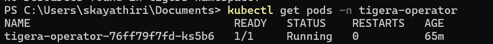
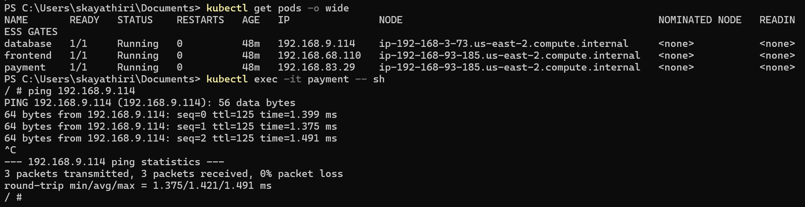
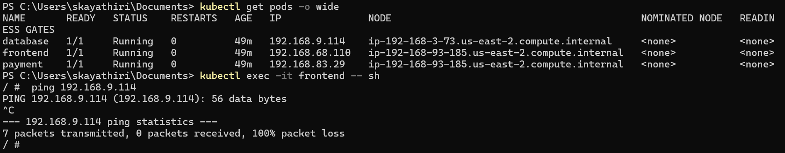
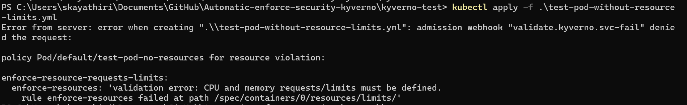
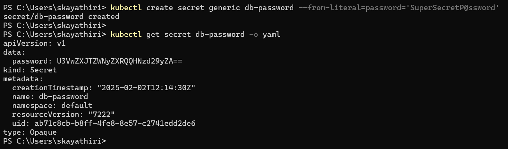

# 🔐 Securing AWS EKS with Kyverno, Calico & GuardDuty

## 1. Overview
As Kubernetes adoption grows, so do security challenges. AWS Elastic Kubernetes Service (EKS) provides a scalable platform, but misconfigurations can lead to security vulnerabilities. This project focuses on implementing security best practices using Kyverno, Calico, GuardDuty, and AWS KMS.

---

## 2. Features
- **Kyverno**: Enforces Kubernetes security policies.
- **Calico**: Implements network restrictions for pod communication.
- **GuardDuty**: Monitors and detects security threats in EKS.
- **AWS KMS**: Encrypts sensitive data for additional security.

---

## 3. Prerequisites
- AWS CLI configured with necessary permissions.
- `eksctl` installed for managing EKS clusters.
- `kubectl` installed for interacting with Kubernetes.
- An existing AWS account with necessary IAM roles.

---

## 4. Project Structure
```
aws-eks-security/
│── calico/
│   ├── calico-network-policy.yml
│   ├── install-cni.yml
│   ├── app-deployment.yml
│
│── kyverno/
│   ├── deny-root-user.yml
│   ├── pods-resource-limits.yml
│   ├── application-deployment-kyverno.yml
│   ├── deny-privilege-containers.yml
│
│── kyverno-test/
│   ├── test-pod-without-resource-limits.yml
│   ├── test-privilege-rule.yml
│
│── guardduty/
│   ├── cryptominer-test.yml       
│
│── kms-secret/
│   ├── db-secret.yml              
│
│── README.md
│── .gitignore
```

---

## 5. Procedure

### 📌 Step 1: Create an EKS Cluster
1. Use `eksctl` to create an EKS cluster:
   ```bash
   eksctl create cluster --name eks-security-cluster --region us-east-1 \
       --nodegroup-name spot-node-group --nodes 2 --nodes-min 1 --nodes-max 3 \
       --node-type t3.medium
   ```


### 📌 Step 2: Implement Network Restrictions using Calico
1. Verify if `aws-node` daemonset is running:
   ```bash
   kubectl -n kube-system get ds aws-node
   ```
2. Install Calico using Tigera Operator:
   ```bash
   kubectl apply --server-side -f https://raw.githubusercontent.com/projectcalico/calico/v3.28.0/manifests/tigera-operator.yaml
   ```
3. Apply CNI configuration:
   ```bash
   kubectl apply -f calico/install-cni.yml
   ```

   Verify the Tigera operators are running properly

   
   
4. Deploy applications (Payment, Database, Frontend):
   ```bash
   kubectl apply -f calico/app-deployment.yml
   ```
5. Restrict database communication so only the Payment app can communicate with it:
   ```bash
   kubectl apply -f calico/calico-network-policy.yml
   ```
6. Verify the network restrictions:
   ```bash
   kubectl get networkpolicy -A
   ```
7. Test access control:
   - Login to the **Payment Pod** and verify it can communicate with the **Database Pod** (should succeed).

     

   - Attempt communication from **Frontend Pod** to **Database Pod** (should fail).
      
      

### 📌 Step 3: Enforce Security Policies using Kyverno
1. Install Kyverno:
   ```bash
   kubectl create -f https://github.com/kyverno/kyverno/releases/download/v1.8.5/install.yaml
   ```
2. Apply security policies to enforce pod restrictions:
   - **Deny Privileged Containers**: Ensures no containers run with elevated privileges.
   ```bash
   kubectl apply -f kyverno/deny-previledge-containers.yml
   ```
   - **Deny Root User Containers**: Prevents running containers as the root user.
   ```bash
   kubectl apply -f kyverno/deny-root-user.yml
   ```
   - **Enforce Resource Limits**: Ensures pods have resource limits set to avoid exhaustion.
   ```bash
   kubectl apply -f kyverno/pods-resource-limits.yml
   ```
   - **Apply below Deployment with kyverno validation Succeed**:
   ```bash
   kubectl apply -f kyverno/application-deployment-kyverno.yml
   ```
   - **Below Deployment should fail as it doesnot met kyverno policy**:
   ```bash
   kubectl apply -f kyvernotest/test-pod-without-resource-limits.yml
   kubectl apply -f kyvernotest/test-priviledge-rule.yml
   
   ```

   

### 📌 Step 4: Enable and Configure GuardDuty
1. Enable GuardDuty for AWS Organization:
   ```bash
   aws guardduty enable-organization-admin-account --admin-account-id <ADMIN_ACCOUNT_ID>
   ```
2. Verify GuardDuty detectors:
   ```bash
   aws guardduty list-detectors
   ```
3. Enable GuardDuty for EKS:
   ```bash
   aws guardduty update-detector --detector-id <DETECTOR_ID> --enable
   ```
4. Deploy a test pod to simulate a security threat:
   ```bash
   kubectl apply -f guardduty/guradduty-test.yaml
   ```
5. Simulate cryptomining activity:
   ```bash
   kubectl exec -it cryptominer-test -- /bin/sh
   ```
   Inside the pod, hit below URL 
   ```bash
   wget http://pool.minexmr.com
   ```
   ✅ AWS should block this cryptomining request, but GuardDuty will detect the attempt.
    
    

   

### 📌 Step 5: Secure Database Credentials using AWS KMS
1. Create an AWS KMS key for encryption:
   ```bash
   aws kms create-key --description "EKS Secrets Encryption Key"
   ```
2. Retrieve the KMS key ARN:
   ```bash
   aws kms describe-key --key-id <key-id> --query "KeyMetadata.Arn"
   ```
3. In the AWS Console, navigate to the **EKS Configuration Page**, enable encryption, and select the KMS key from the dropdown.
4. Store database password securely using Kubernetes Secrets:
   ```bash
   kubectl create secret generic db-password --from-literal=password='SuperSecretP@ssword'
   ```
5. Verify secret storage:
   ```bash
   kubectl get secret db-password -o yaml
   ```
   
6. Apply the Kubernetes secret configuration:
   ```bash
   kubectl apply -f kms-secret/db-secret.yaml
   ```
    
---

This guide provides a streamlined approach to securing AWS EKS clusters using industry best practices. 🚀

